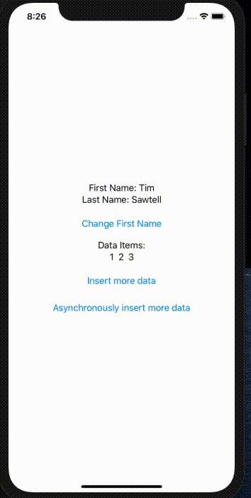

# swiftui-rowducks
Global App State Management for SwiftUI Applications.

Not to be confused with a completely unrelated, amazing state management library [Redux](https://redux.js.org/)

Example app shows how to create a store, use actions, compose your App's state via reducers, and finally how to wire that in to your SwiftUI View for automatic re-rendering

You dispatch actions (sync or async) to your store, and it will alter your state object by running your reducers. Then SwiftUI will automatically update your UI through the @ObjectBinding view property. 

